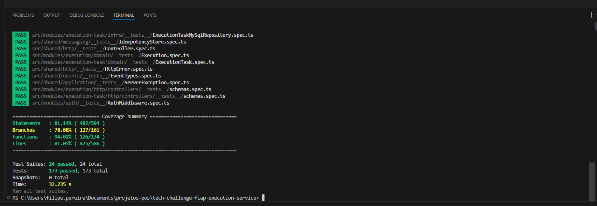

# Execution Service (Microsserviço de Execução)

Microsserviço responsável pelo controle de produção, execução de reparos, alocação de mecânicos, tarefas e entrega de veículos.

## Domínios

- **Execution** — Registro de execução vinculado a uma Ordem de Serviço (estado: waiting → in_progress → finished → delivered)
- **Execution Task** — Sub-tarefas de uma execução (estado: pending → in_progress → done)

## Tecnologias

- Node.js 22 + TypeScript
- Express
- MySQL (mysql2)
- AWS SQS (mensageria assíncrona)
- Zod (validação)
- Jest + Supertest (testes)
- Docker + Kubernetes

## Estruturas

```
src/
├── server.ts
├── utils/logger.ts
├── infra/db/
├── shared/
│   ├── application/
│   ├── domain/
│   ├── events/
│   ├── http/
│   ├── messaging/
│   └── resilience/
└── modules/
    ├── auth/
    ├── execution/
    └── execution-task/
```

## Eventos SQS

### Publicados
| Evento | Descrição |
|--------|-----------|
| `execution.repair-started` | Mecânico iniciou o reparo |
| `execution.repair-finished` | Reparo concluído |
| `execution.delivered` | Veículo entregue ao cliente |

### Consumidos
| Evento | Origem | Ação |
|--------|--------|------|
| `os.budget-approved` | OS Service | Cria execução pendente |
| `billing.payment-confirmed` | Billing Service | Autoriza início da execução |

## Endpoints

### Auth
- `POST /auth/validate` — Validar token JWT

### Executions
- `POST /executions` — Criar execução (admin)
- `GET /executions/:id` — Buscar execução por ID
- `GET /executions/by-order/:serviceOrderId` — Buscar por ID da ordem de serviço
- `POST /executions/:id/start` — Iniciar reparo (admin/mechanic)
- `POST /executions/:id/finish` — Finalizar reparo (admin/mechanic)
- `POST /executions/:id/deliver` — Confirmar entrega (admin)
- `GET /executions/:id/execution-time` — Tempo de execução
- `GET /executions/execution-time/average` — Tempo médio de execução (admin)

### Execution Tasks
- `POST /execution-tasks` — Criar tarefa (admin/mechanic)
- `GET /execution-tasks/:id` — Buscar tarefa por ID
- `GET /execution-tasks/execution/:executionId` — Listar tarefas de uma execução
- `PUT /execution-tasks/:id` — Atualizar tarefa (admin/mechanic)
- `DELETE /execution-tasks/:id` — Remover tarefa (admin)
- `POST /execution-tasks/:id/start` — Iniciar tarefa (admin/mechanic)
- `POST /execution-tasks/:id/complete` — Concluir tarefa (admin/mechanic)

## Setup Local

```bash
npm install
cp .env.example .env
# Configurar variáveis no .env
npm run dev
```

## Testes

```bash
npm test
npm run test:coverage
```

## Captura de testes



## Deploy

```bash
docker build -t execution-service .
kubectl apply -f k8s/
```

## Variáveis de Ambiente

| Variável | Descrição |
|----------|-----------|
| `PORT` | Porta do servidor (default: 3002) |
| `DB_HOST` | Host MySQL |
| `DB_PORT` | Porta MySQL |
| `DB_USER` | Usuário MySQL |
| `DB_PASS` | Senha MySQL |
| `DB_NAME` | Nome do banco |
| `JWT_SECRET` | Segredo JWT |
| `AWS_REGION` | Região AWS |
| `AWS_ACCESS_KEY_ID` | Chave de acesso AWS |
| `AWS_SECRET_ACCESS_KEY` | Chave secreta AWS |
| `SQS_EXECUTION_QUEUE_URL` | URL fila SQS execution |
| `SQS_OS_QUEUE_URL` | URL fila SQS OS |
| `SQS_BILLING_QUEUE_URL` | URL fila SQS billing |